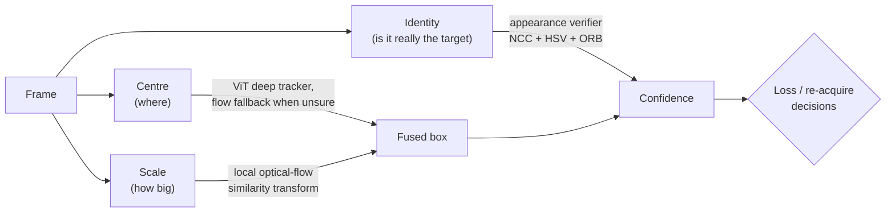
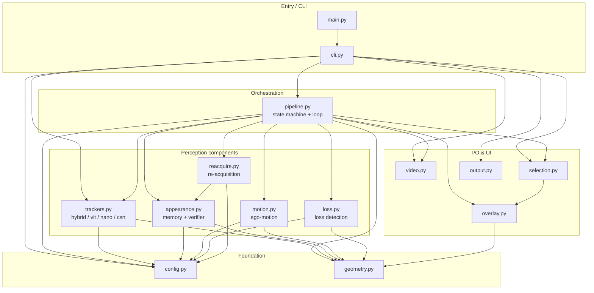
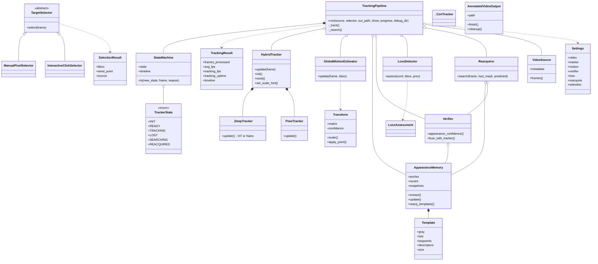
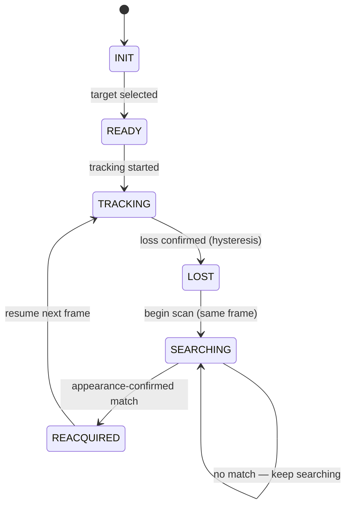
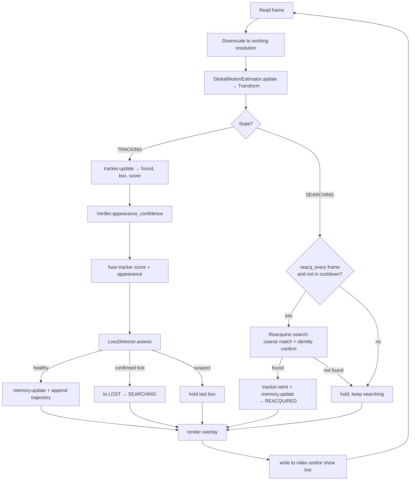
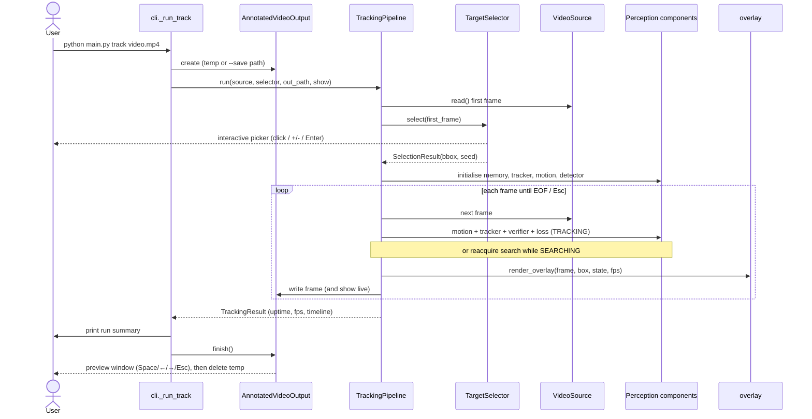
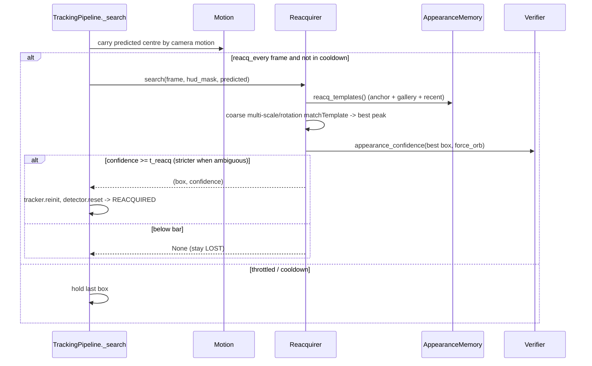

# High-Level Design - Real-Time Arbitrary Object Tracking & Re-acquisition

## 1. Purpose

A **CPU-only** application that tracks an arbitrary, user-selected object through a
video and **re-acquires** it after it is lost (occlusion, leaving frame, drastic
appearance/scale change).

---

## 2. The core idea - three decoupled signals

A deep tracker alone drifts or balloons because it tries to answer three questions
with one score. This system answers them **separately** and fuses the results:

- **Centre** — OpenCV `TrackerVit` (ONNX, CPU) when confident; otherwise the local
  flow centre (the target is too small/low-texture for the ViT to lock early).
- **Scale** — a local Lucas-Kanade + RANSAC **similarity transform** on features
  inside the box gives the true per-frame zoom, damped by the global camera scale.
- **Identity** — an independent **verifier** (grayscale NCC + HSV histogram +
  ORB/RANSAC inliers) over an **appearance memory**; its confidence, fused with the
  tracker score, drives loss detection and confirms re-acquisition.

---

## 3. Component / module view

Modules are a flat set on the import path (`src/`). Arrows mean "depends on".

| Module | Responsibility |
|---|---|
| `main.py` | Root entry; puts `src/` on the path and calls the CLI. |
| `cli.py` | Argument parsing, dispatch, run-summary printing. |
| `pipeline.py` | Streaming loop, `TrackerState` machine, FPS metering, result assembly. |
| `trackers.py` | Backend implementations behind one interface; the hybrid ViT+flow tracker. |
| `motion.py` | Global camera (ego) motion as a similarity `Transform`. |
| `appearance.py` | `AppearanceMemory` (anchor + recent + gallery) and the multi-cue `Verifier`. |
| `loss.py` | Fused-confidence loss detection with hysteresis. |
| `reacquire.py` | Coarse multi-scale search + full-identity confirm while LOST. |
| `selection.py` | Target selectors (manual + interactive) and burned-in HUD handling. |
| `video.py` | Streaming `VideoSource` over `cv2.VideoCapture`. |
| `output.py` | Save vs. temp-preview lifecycle + the in-process preview player. |
| `overlay.py` | Drawing the box, trail, seed marker, and HUD panel. |
| `config.py` | Typed, validated `Settings` (single source of truth). |
| `geometry.py` | `BBox` + pure clamp/patch/resize helpers. |

---

## 4. Class view

---

## 5. Tracker state machine

---

## 6. Per-frame data flow

---

## 7. Sequence - a full `track` run

---

## 8. Sequence - re-acquisition (while LOST)

