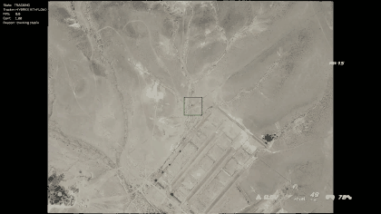

# Real-Time Arbitrary Object Tracking & Re-acquisition


A **CPU-only** Python/OpenCV application that tracks an arbitrary, user-selected object
through a video and **re-acquires** it automatically after it is lost — through
occlusion, leaving the frame, or drastic changes in appearance and scale.

## Example

Tracking the drone "hut" target through the descent — the box grows with the target
as it zooms from a speck to filling the frame:



## Features

- Arbitrary, class-agnostic object selection from a single click
- CPU-only execution (no GPU required)
- Real-time tracking on 1080p footage
- Automatic loss detection and re-acquisition
- Multi-cue appearance verification (NCC + HSV histogram + ORB)
- Ego-motion (camera) compensation
- Multiple tracker backends (hybrid / ViT / Nano / CSRT)
- Interactive target selection (click, drag, resize)
- Debug visualization of the re-acquisition search
- Local files and direct video URLs

## Design goals

- **CPU-only** — no special hardware
- **Lightweight** — real-time per-frame pipeline
- **Modular** — decoupled, independently testable components
- **Explainable** — every decision is visible in the state timeline and confidence
- **Extensible** — pluggable tracker backends, appearance cues, and selectors

## How it works

A single tracker conflates three questions and drifts or balloons as a result. This
system answers them **separately** and fuses the results:

- **Centre (where)** — OpenCV `TrackerVit` (a deep Siamese tracker, ONNX on CPU) when
  confident; otherwise the local optical-flow centre.
- **Scale (how big)** — a local Lucas–Kanade + RANSAC similarity transform gives the
  true per-frame zoom, so the box grows with the target.
- **Identity (is it really the target)** — an appearance verifier (grayscale NCC + HSV
  histogram + ORB/RANSAC) over an appearance memory; its confidence, fused with the
  tracker score, drives loss detection and confirms re-acquisition.

**Per-frame pipeline:**

```text
read frame → downscale → ego-motion → tracker (centre + scale) → verifier (identity)
           → loss check → TRACKING: learn/hold   |   SEARCHING: confirmed search
           → draw overlay → write / preview
```

**State machine:** the target is declared **LOST** only after several consecutive
low-confidence frames (hysteresis, default 8), which avoids chatter. While lost, a
full-frame appearance-confirmed search runs until the target returns.

```text
INIT → READY → TRACKING → LOST → SEARCHING → REACQUIRED → TRACKING
                  ▲                   │
                  └──── re-acquired ──┘   (else keep SEARCHING)
```

The heavy full-frame search runs **only while lost**, so steady-state tracking stays
real-time. A burned-in HUD overlay (crosshair/telemetry) is detected and excluded from
matching. See [`HLD.md`](HLD.md) for the full architecture, diagrams, and design notes.

## Requirements

| | |
|---|---|
| **Python** | 3.10+ (developed on 3.13) |
| **OpenCV** | `opencv-contrib-python` 5.0 — **not** `opencv-python-headless` (the contrib build provides `TrackerVit`/`TrackerNano`/CSRT and the HighGUI windows this app uses) |
| **NumPy** | 2.5 |
| **OS** | Linux / macOS / Windows |

Exact pins are in [`requirements.txt`](requirements.txt).

## Setup

```bash
python3 -m venv .venv
source .venv/bin/activate            # Windows: .venv\Scripts\activate
pip install -r requirements.txt
python download_models.py            # fetch the ViT ONNX (~0.7 MB) if not vendored
```

## Usage

```bash
# the default workflow — no flags required:
python main.py track sample-video.mp4
```

This opens the first frame for **interactive selection**, tracks the target **live**,
then **previews** the annotated result and cleans up after itself.

**Selecting the target** (first frame):

| Action | Control |
|---|---|
| Place / move the box centre | **click** or **drag** |
| Resize the box (within configured min/max) | **`+`** / **`-`** |
| Confirm | **`Enter`** / **`Space`** |
| Cancel | **`Esc`** |

**Previewing the result** (when `--save` is not used, the annotated video plays in a
window, then is deleted when you close it):

| Action | Control |
|---|---|
| Pause / resume | **`Space`** |
| Seek back / forward | **`←`** / **`→`** |
| Restart | **`r`** |
| Close (finish the run) | **`Esc`** or the window's close button |

### Examples

```bash
python main.py track video.mp4                            # interactive + live view + temp preview
python main.py track video.mp4 --headless                 # no live window; still previews the result
python main.py track video.mp4 --headless --save out.mp4  # no live window; keep out.mp4
python main.py track video.mp4 --pixel 545,960            # scriptable: skip the selector
python main.py --info video.mp4                           # print metadata + backend availability
```

### Options

`python main.py track <source> [options]` — `<source>` is a local video file or a
direct video URL (`http`/`https`/`rtsp`/...).

| Flag | Description |
|---|---|
| `--pixel I,J` | Pick the target non-interactively at pixel `row,col`; bypasses the selector. |
| `--save PATH` | Save the annotated video to `PATH`. Without it, the result is a temp file that is previewed, then deleted. |
| `--backend NAME` | Tracker backend: `hybrid` (default), `vit`, `nano`, or `csrt`. Overrides the config. |
| `--bbox N` | Initial bounding-box side length in pixels. Overrides the config default. |
| `--headless` | Run without the live tracking window (the result is still previewed / saved). |
| `--debug DIR` | Dump per-frame candidate visualizations while re-acquiring, into `DIR`. |

Top-level: `python main.py --info <source>` prints the source's metadata and which
tracker backends this OpenCV build can run, then exits.

**Backends:** `hybrid` (default) is the ViT + optical-flow design described above.
`vit` / `nano` are single deep backends. `csrt` is a classical fallback that needs
**no model download** — handy for a quick smoke test (`nano` needs
`python download_models.py --nano`).

## Output

The annotated video (and the live view) draws the box, its recent trajectory, and a
status panel:

| Element | Meaning |
|---|---|
| **Green** box | tracking / re-acquired |
| **Orange** box | searching (target lost, scanning the frame) |
| **Red** box | lost |
| Trail line | recent centre path |
| HUD panel | `State`, `Tracker`, `FPS`, `Conf`, `Reason` |

Each run also prints a summary — uptime, lost/re-acquired counts, the state timeline,
and processing FPS:

```text
$ python main.py track sample-video.mp4 --pixel 545,960 --save out.mp4
Target pixel [i=545, j=960] -> (x=960, y=545), bbox 90px
  processed 855/855 frames (100.0%)
Done.
Frames processed: 855
  Processing FPS:   avg 38.6 | min 14.2 | max 71.9
  Tracking uptime:  99.1%
  Final state:      TRACKING
  Lost / Reacquired: 1 / 1
  Timeline:
    frame     0  READY       target selected
    frame     0  TRACKING    tracking started
    frame   274  LOST        low confidence
    frame   274  SEARCHING   searching
    frame   319  REACQUIRED  reacquired
    frame   320  TRACKING    resumed
  Output video:     out.mp4
```

## Configuration

All tunables live in [`src/config.py`](src/config.py) as validated dataclass defaults —
the single source of truth, checked on construction (out-of-range values raise
`ConfigError`). Sections: `video`, `selection` (incl. HUD-overlay handling), `tracker`
(backend + flow-scale), `motion` (ego-motion), `verifier` (cue weights + memory gates),
`loss` (hysteresis), `reacquire` (appearance-confirmed search). The `--backend` and
`--bbox` flags override the relevant fields per run; edit the file to tune the rest.

## Testing

The tracking engine was evaluated on a range of scenarios rather than a single clip:

- static camera and moving (aerial) camera
- partial occlusion and temporary target loss
- large scale changes and fast motion

The final architecture reflects the results of these evaluations rather than
theoretical assumptions. In addition, the pure-logic components (geometry, loss
hysteresis, appearance cues, selection, output lifecycle) are unit-tested, and the full
pipeline is validated end-to-end on generated clips.

## Limitations

- Tracks a **single** target at a time.
- Assumes a **mostly-rigid scene** (camera motion should dominate).
- Needs a **visually distinct** target — near-identical repeating background can delay
  re-acquisition or drift onto a look-alike (as at the end of the bush clip).
- Recovery depends on the search proposing the true target; if it isn't generated or is
  out-scored by distractors, re-acquisition is delayed.
- Loosening the identity thresholds speeds recovery but risks false locks and drift, so
  the defaults favor precision over aggressive recovery.
- The drone "hut" result isn't fully repeatable: one seed tracked it perfectly (100%
  uptime), others fell short — early on it's a sub-resolution speck, so tiny seed
  changes diverge before re-acquisition can help. See examples folder for reference.

## Future work

- **Multi-object tracking** – Track multiple independent targets simultaneously.
- **GPU acceleration** – Improve throughput for high-resolution videos.
- **Asynchronous recovery pipeline** – Keep live playback responsive during re-acquisition.
- **Long-term appearance memory** – Improve recovery after long occlusions or appearance changes.
- **Multi-camera support** – Continue tracking across multiple camera views.

## Project layout

```text
tracker-system/
  main.py                 # entry point -> package CLI
  download_models.py      # fetch the ViT / NanoTrack ONNX models
  models/vittrack.onnx    # vendored ViT tracker weights
  HLD.md                  # high-level design (diagrams + state machine)
  src/                    # flat module set (on the import path via main.py)
    cli.py                # --info and track commands
    pipeline.py           # streaming loop + state machine + FPS meter
    trackers.py           # backends: hybrid (ViT+flow), vit, nano, csrt
    appearance.py         # appearance memory (+ gallery) + multi-cue verifier
    motion.py             # global ego-motion estimator
    loss.py               # fused-confidence loss detection
    reacquire.py          # appearance-confirmed re-acquisition
    selection.py          # manual + interactive selectors + HUD handling
    output.py             # annotated-video save vs. temp-preview + cleanup
    overlay.py            # bbox / trajectory / HUD drawing
    geometry.py           # BBox + clamp/patch/resize helpers
    config.py             # typed, validated settings
    video.py              # streaming VideoSource
```
